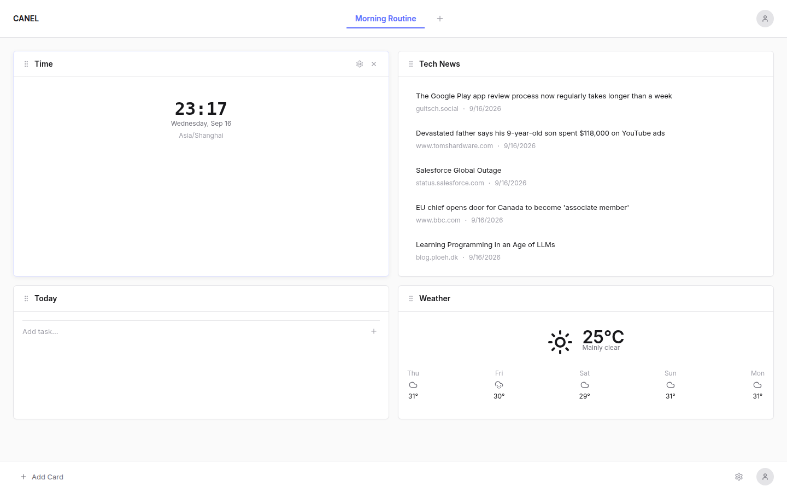
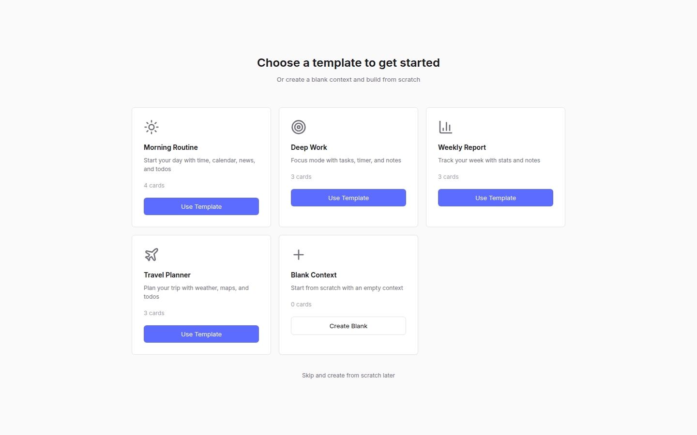
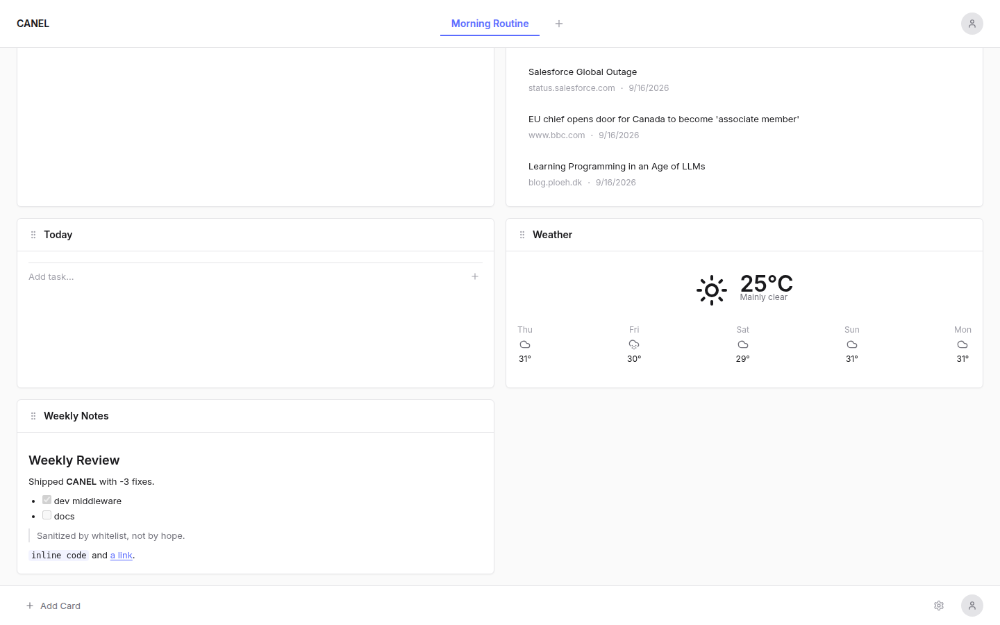
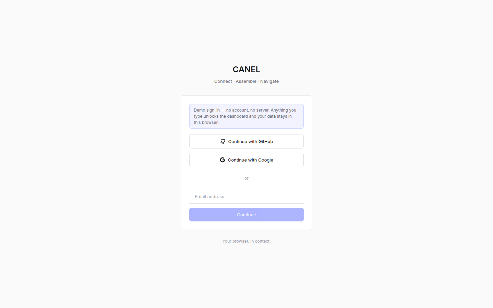
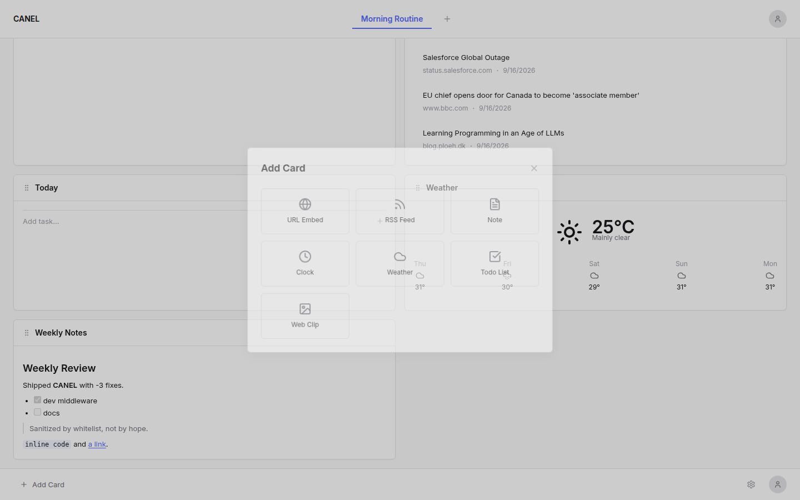

# CANEL — Contextual Workspace

> **C**onnect · **A**ssemble · **N**avigate. Your browser, in context.

CANEL is a local-first **context-aware dashboard / new-tab app**. Instead of one flat pile of bookmarks, you
group cards (clock, weather, RSS, todos, notes, URL embeds, web clips) into named **contexts** — "Morning
Routine", "Deep Work", "Travel Planner" — and switch between them with a click. Everything is rendered
client-side and persisted in `localStorage`; the Express server only serves the app.



## Features

- **Contexts** — group cards into contexts, switch with tabs, up to 5 per workspace.
- **Card types** — Clock, Weather, RSS feed, Todo list, Markdown note, URL embed, Web clip (bookmark).
- **Drag & drop** — reorder cards with `@dnd-kit` (pointer and keyboard sensors).
- **Card configuration** — per-type config modal (feed URL, city, embed URL, display count, size).
- **Template market** — first-run onboarding with four ready-made contexts plus a blank one.
- **Themes** — light / dark / follow-system, driven by CSS custom properties.
- **Local-first** — no account, no server round-trips; state lives in your browser.
- **Markdown notes** — rendered with `marked` and sanitized through a strict tag/attribute whitelist
  (no third-party sanitizer dependency).
- **Cloud-ready server shell** — Express + Vite middleware in dev, static SPA serving in production.

## Screenshots

| Template market | Markdown note (sanitized) |
| --- | --- |
|  |  |

| Sign-in (demo) | Add card panel |
| --- | --- |
|  |  |

All screenshots are captured at 1440×900 by [`docs/screenshots/capture.mjs`](docs/screenshots/capture.mjs).

## Tech stack

| Layer | Choice |
| --- | --- |
| Build | Vite 7 |
| UI | React 19 + TypeScript 5 (strict) |
| Styling | Tailwind CSS 3 + CSS custom-property design tokens (`DESIGN.md`) |
| Drag & drop | `@dnd-kit/core` + `@dnd-kit/sortable` |
| Icons | `lucide-react` |
| Markdown | `marked` + built-in whitelist sanitizer (`src/sanitize.ts`) |
| Server | Express 4 (`server/`), bundled to CJS with `tsup` |
| Package manager | pnpm 9 (npm/yarn are blocked by `preinstall`) |

## Getting started

Requires Node.js ≥ 18 and pnpm ≥ 9.

```bash
pnpm install          # install dependencies
pnpm dev              # dev: Express + Vite middleware with HMR
pnpm build            # build dist/ (client) and dist-server/server.js (server)
pnpm start            # run the production server (needs pnpm build first)
```

Then open <http://localhost:5000>.

Useful scripts:

| Script | What it does |
| --- | --- |
| `pnpm dev` | Dev server on `PORT` (default 5000) via `scripts/dev.sh` |
| `pnpm build` | `vite build` + `tsup` bundle of the Express server |
| `pnpm start` | Runs `node dist-server/server.js` |
| `pnpm ts-check` | `tsc --noEmit` |
| `pnpm lint` / `pnpm lint:style` | ESLint / Stylelint |
| `pnpm validate` | ts-check + ESLint + Stylelint |

### Environment variables

| Variable | Default | Purpose |
| --- | --- | --- |
| `PORT` | `5000` | Port the Express server listens on (dev and prod) |
| `COZE_PROJECT_ENV` | `PROD` for `pnpm start`; otherwise dev | Any value other than `PROD` makes the server run Vite middleware (dev path) instead of serving `dist/` |
| `VITE_HMR_PATH` | Vite default | Override the HMR socket path (only needed behind a reverse proxy) |
| `VITE_HMR_PORT` | Vite default | Override the HMR socket port |
| `VITE_HMR_CLIENT_PORT` | Vite default | Override the port the browser dials for HMR |
| `DEPLOY_RUN_PORT` | `PORT` | Port used by `scripts/dev.sh` / `scripts/start.sh` |

## Project structure

```
.
├── index.html                 # SPA entry (mounts #app)
├── vite.config.ts             # Vite config; HMR settings are env-overridable
├── tailwind.config.js         # Design tokens -> Tailwind theme mapping
├── DESIGN.md                  # Visual spec (palette, type, radius, motion, taboos)
├── AGENTS.md                  # Contributor / coding conventions
├── docs/screenshots/          # README screenshots + capture script
├── scripts/                   # build / dev / start / validate (.sh and .ps1)
├── server/
│   ├── server.ts              # Express entry: logging, routes, Vite, error handler
│   ├── vite.ts                # dev middleware / prod static + SPA fallback
│   └── routes/index.ts        # /api/hello, /api/data, /api/health (demo endpoints)
└── src/
    ├── main.tsx               # React root
    ├── App.tsx                # signed-out -> LoginPage, signed-in -> Dashboard
    ├── Dashboard.tsx          # context tabs, card grid, modals, time triggers
    ├── store.tsx              # useReducer store, localStorage persistence, migrations
    ├── sanitize.ts            # whitelist HTML sanitizer for Markdown notes
    ├── types.ts / utils.ts    # domain types + helpers
    ├── index.css              # CSS variables (design tokens) + component styles
    ├── components/            # shells: tabs, grid, card container, modals, menus
    │   └── cards/             # the 7 card renderers
    └── ...
```

## Data & storage

- App state is persisted under the `canel-state` key with a `version` field (`SCHEMA_VERSION` in `src/store.tsx`).
  Older or hand-edited payloads are normalized on load so a missing field can never white-screen the dashboard.
- Todo lists and note bodies live in their own keys (`canel-todo-<cardId>`, `canel-note-<cardId>`), which are
  removed when the owning card is deleted.
- Nothing leaves the browser. There is no backend database and no sync.

## Limitations (read before you expect production behaviour)

- **Authentication is a demo.** `LoginPage` fabricates a `UserData` object locally — there is no OAuth, no
  backend, no token, and no authorization boundary. Any input unlocks the dashboard; treat it as a UI
  placeholder for a real auth flow.
- **Third-party public APIs.** Weather uses Open-Meteo (no key), RSS uses the `api.rss2json.com` free tier,
  and favicons come from `google.com/s2/favicons`. Availability, rate limits, and privacy depend on those
  services; self-hosting a feed proxy would be the next step for real use.
- **URL embeds are best-effort.** Many sites send `X-Frame-Options: DENY` / `frame-ancestors` and will stay
  blank. The embed sandbox deliberately omits `allow-same-origin`, so it is a read-only view — use
  "Open in a new tab" for anything interactive.
- **Time triggers have no UI.** `triggerRules` exists in the data model and the Dashboard evaluates them, but
  no component creates rules yet, so the feature is effectively dormant.
- **Contexts are capped at 5** ("free plan" limit enforced in `ContextTabBar`).
- **`localStorage` limits.** State is written in full on every change; a few MB is the practical ceiling, so
  it is not a place for large notes or long feeds.
- **The `server/` shell is scaffolding.** `/api/hello`, `/api/data`, and `/api/health` are untouched
  examples from the original template; the frontend does not call them.

## License

No license has been selected for this repository yet.
